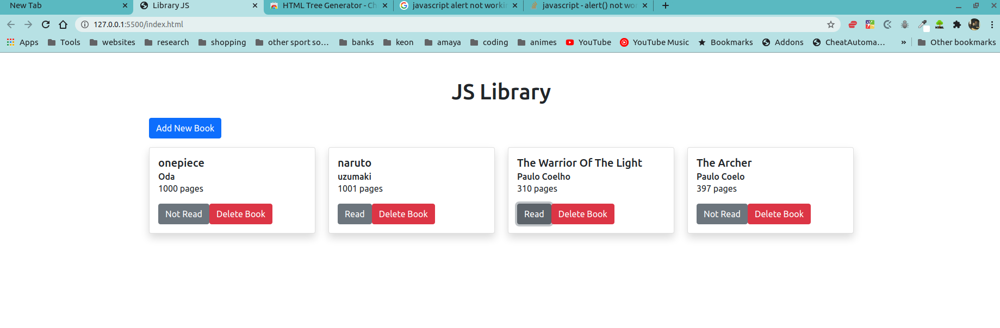

# Project Library

> This is the very first project of the Javascript module

## Built With

- Bootstrap
- Javascript

## Live Demo

[Live Demo Link](https://alejandrotoledoweb.github.io/js_library/)

## Getting Started

**To get a copy of the code please click on the green button on the top right corner that says code**
**And run in your console `git clone git@github.com:alejandrotoledoweb/js_library.git`**

### Prerequisites

- Npm
- Node.js
- VS Code

## Authors

👤 **Alejandro Toledo**

- GitHub: [@alejandrotoledoweb](https://github.com/alejandrotoledoweb)
- Twitter: [@alejot](https://twitter.com/alejot)
- LinkedIn: [Alejandro Toledo](https://www.linkedin.com/in/alejandro-toledo-3b444b109/)

👤 **Author2**

- GitHub: [@cvilla714](https://github.com/cvilla714)
- Twitter: [@kckeyti](https://twitter.com/kckeyti)
- LinkedIn: [Cosmel Villalobos](https://www.linkedin.com/in/cosvilla/)

## 🤝 Contributing

Contributions, issues, and feature requests are welcome!

Feel free to check the [issues page](issues/).

## Show your support

Give a ⭐️ if you like this project!

## 📝 License

This project is [MIT](lic.url) licensed.
